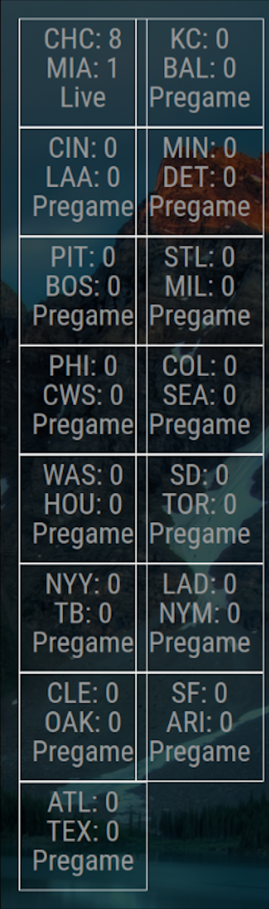

# MMM-MLB-Scoreboard

A [MagicMirror²](https://magicmirror.builders/) module that displays the days Major League Baseball games.

## Screenshot



## Installation

1. Navigate to the MagicMirror modules folder

```bash
cd MagicMirror/modules
```

2. Clone the repository from Github

```bash
git clone https://github.com/jclarke54/MMM-MLB-Scoreboard
```

3. Navigate to the module folder

```bash
cd MagicMirror/modules/MMM-MLB-Scoreboard
```

4. Install the dependencies

```bash
npm install 
```

5. Add the module to your `config.js` file array

```js
modules: [
  ...
  {
    module: "MMM-MLB-Scoreboard",
    position: "top_left",
    .....
  },
]
```

